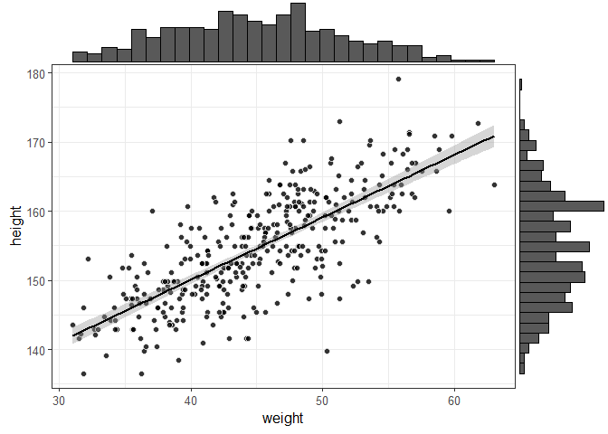
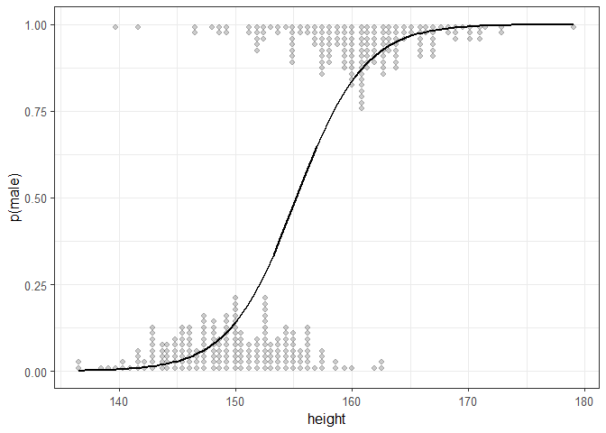

<!-- README.md is generated from README.Rmd. Please edit that file -->

# Explorando caracteristicas do modelo linear generalizado

O objetivo deste projeto é treinar a aplicação de modelos de regressão
linear e criar gráficos de dispersão que apresentem paramêtros
relacionados a qualidade do modelo. Para isso, será replicada algumas
análises realizadas pelo Ladislas Nalborczyk em seu texto “Using R to
make sense of the generalised linear model”

Para criação das figuras e modelos foi utilizada a base de dados Howell1
do pacote Rethinking (McElreath, 2016), que contém dados sobre 544
indivíduos, incluindo altura (centímetros), peso (quilogramas), idade
(anos) e sexo (0 indicando feminino e 1 indicando masculino).

``` r
# Lendo os pacotes --------------------------------------------------------

library(rethinking)
library(ggplot2)
library(ggExtra)
```

Após filtrar a base de dados apenas com os dados pertencentes aos
indíviduos com idade igual ou maior que 18 anos (&gt;=18), foi criado um
gráfico de dispersão utilizando o ggplot2 (i.e., geom\_point e
geom\_smooth). Um objeto foi criado com o gráfico (p). Em seguida, foi
utilizada a função ggMarginal do pacote ggExtra para criar um gráfico de
dispersão com os histogramas em cada um dos eixos.

``` r
# Abrindo, criando um elemento (d) e visualizando a base ------------------

data("Howell1")

# Filtrando a idade (>18yr) -----------------------------------------------

d <- Howell1 |>
  dplyr::filter(age >= 18)
```

``` r
# Criando um grafico de dispersão -----------------------------------------

p <- d |>
  ggplot(mapping = aes(x = weight, y = height)) +
  geom_point(pch = 21, color = "white", fill = "black", size = 2, alpha = 0.8) +
  geom_smooth(method = "lm", color = "black", se = TRUE)+
  theme_bw(base_size = 12)


# Usando ggExtra para fazer grafico de dispersão com histograma -----------

ggMarginal(p, type = "histogram")
```



Uma rápida inspeção visual do conjunto de dados revela uma relação
positiva entre altura e peso. A linha da regressão traçada no grafico
acima corresponde ao seguinte modelo linear assumindo uma distribuição
normal:

**Peso \~ Normal (µi, σ)**

**µi = α + β ∙ 43**

que pode ser excrita com a sintaxe:

lm(formula, data, subset, weights, na.action, method = “qr”, model =
TRUE, x = FALSE, y = FALSE, qr = TRUE, singular.ok = TRUE, contrasts =
NULL, offset, …)

Assim, o código para esta análise e o resultado serão:

``` r
mod1 <- lm(height ~ weight, data = d)

mod1
#> 
#> Call:
#> lm(formula = height ~ weight, data = d)
#> 
#> Coefficients:
#> (Intercept)       weight  
#>     113.879        0.905
```

O intercept (i.e., 113.879) representa a altura prevista quando o peso
está em 0 (o que não faz muito sentido neste caso), enquanto o slope
(i.e., 0.905) representa a mudança na altura quando o peso aumenta em
uma unidade (e.g., um quilograma).

# Fazendo predições e ajustes no modelo

A principal vantagem de um modelo de regressão é a possibilidade de
fazer previsões como, por exemplo, baseado no modelo apresentado acima,
qual é a altura esperada para um indivíduo com 43 kg. No R isto é
realizado criando um geom\_point e marcando a linha referente ao peso
que você quer fazer a predição da estatura e usando a função predict,
que é igual a α + β \* 43.

Vamos testar!

``` r
# Fazendo gráfico com linhas referentes ao peso que queremos preve --------
wght <- 43

d |> 
  ggplot(mapping = aes(x = weight, y = height)) +
  geom_line(mapping = aes(y = predict(mod1)), size = 1) +
  geom_point(size = 2, alpha = .2) +
  geom_segment(
    x = wght, xend = wght,
    y = 0,
    yend = predict(mod1, newdata = data.frame(weight = wght)),
    linetype = 2, lwd = 0.5) +
  geom_segment(
    x = 0, xend = wght,
    y = predict(mod1, newdata = data.frame(weight = wght)),
    yend = predict(mod1, newdata = data.frame(weight = wght) ),
    linetype = 2, lwd = 0.5
  ) +
  theme_bw(base_size = 12)
```


Conforme o autor do texto ensina, implementar a função predict
manualmente é fácil. Vamos testar para ver como funciona.

``` r
# Aplicando a função predict ----------------------------------------------

d <- d |> 
  dplyr::mutate(
    pred_mod1 = predict(mod1),
    pred_mod1_2 = coef(mod1)[1] + coef(mod1)[2] * weight
  )

head(d)
#>    height   weight age male pred_mod1 pred_mod1_2
#> 1 151.765 47.82561  63    1  157.1630    157.1630
#> 2 139.700 36.48581  63    0  146.9001    146.9001
#> 3 136.525 31.86484  65    0  142.7180    142.7180
#> 4 156.845 53.04191  41    1  161.8839    161.8839
#> 5 145.415 41.27687  51    0  151.2362    151.2362
#> 6 163.830 62.99259  35    1  170.8895    170.8895
```

Como dá para perceber, a função predict está simplesmente recuperando
parâmetros do modelo ajustado (neste caso, pelo intercept e slope) para
fazer previsões sobre a variável de resultado, dados alguns valores do
(s) preditor (es). Este modelo ajustado corresponde à segunda linha do
código descrito acima (i.e.,pred\_mod1\_2).

# Fazendo predições para desfechos binários

É vbem comum querer predizer desfechos binários (e.g., sim e não, tem e
não tem). E o modelo mais adequado para fazer isso é por meio de modelos
de regressão logística.

Para realizar uma regressão logística no R utiliza-se a função **glm**,
onde o argumento **family** é usado para especificar a probabilidade do
modelo e a função de ligação. Para isso, utiliza-se a função glm cuja
sintaxe é:

glm(formula, family = gaussian, data, weights, subset, na.action, start
= NULL, etastart, mustart, offset, control = list(…), model = TRUE,
method = “glm.fit”, x = FALSE, y = TRUE, singular.ok = TRUE, contrasts =
NULL, …)

Para testar a função glm, segue abaixo o código sendo aplicado na base
de dados que estamos usando para predizer o sexo pela estatura e o
resultado.

``` r
mod2 <-
  glm(male ~ height,
      data = d,
      family = binomial(link = "logit"))
mod2 <-
  glm(male ~ height,
      data = d,
      family = binomial(link = "logit"))


# Aplicado o modelo para predizer o sexo pela estatura usando a predict----
# e fitted ----------------------------------------------------------------

d <- 
  d |> 
  dplyr::mutate(
    pred_mod2 = predict(mod2),
    fitted_mod2 = fitted(mod2)
  )

# Selecionando e vendo o resultado ----------------------------------------

d |> 
  dplyr::select(height, weight, male, pred_mod2, fitted_mod2) |> 
  head()
#>    height   weight male  pred_mod2 fitted_mod2
#> 1 151.765 47.82561    1 -1.1910139 0.233077651
#> 2 139.700 36.48581    0 -5.3387584 0.004778882
#> 3 136.525 31.86484    0 -6.4302701 0.001609421
#> 4 156.845 53.04191    1  0.5554049 0.635388646
#> 5 145.415 41.27687    0 -3.3740373 0.033116790
#> 6 163.830 62.99259    1  2.9567306 0.950580634
```

Conforme o autor destaca, diferente do modelo linear utilizado para
variável continuas, neste modelo o predic e o fitted apresentou
resultados bastante diferentes. O autor explica que a saída das funções
predict e fitted são diferentes quando usamos um GLM porque a função
predict retorna previsões do modelo na escala do preditor linear (neste
exempo, na escala log-odds), enquanto a função fitted retorna previsões
na escala da resposta. De maneira generosa, o autor disponibiliza uma
função criada por ele (logit\_dotplot.R) para realizar um gráfico para
uma regressão logística. Abaixo, segue a chamada da função mais a
aplicação dela nesta base de dados.

``` r
source("logit_dotplot.R")
logit_dotplot(d$height, d$male, xlab = "height", ylab = "p(male)")
```


\# Verificando erros e residuos com a função rediduals
